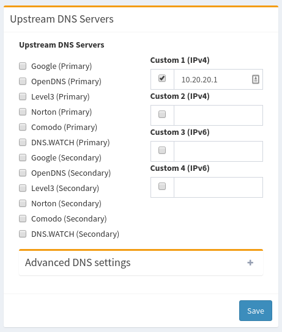

= Pi-hole: Blocking b(ad) stuff via DNS
Chuck Frain <chuck@chuckfrain.net>
:toc: left
:split:

== Introduction

This talk is to help you block unwanted sites from your network at the DNS level.
We will go over at a high level what DNS does and how Pi-hole works.

As time and the live-demo laws permit, we will demonstrate Pi-hole.

== What is DNS?

DNS stands for Domain Name System.
It translates the IP address of a computer to a hostname.

calug.org translates to 173.236.168.90

google.com translates to 172.217.7.238

== What is Pi-hole

----
The Pi-hole is an advertising-aware DNS/Web server. If an ad domain is queried, a small Web page or GIF is delivered in place of the advertisement.
----
* The install script works best on Debian, Fedora, and their dervitives
* Uses dnsmasq as the DNS server software
** I've seen some posts indicating bind will be an option in the future
* Primarily used to block malware and advertising domains
* Accommodates Whitelists and Blacklists
* Can act as a DHCP server

== Ways to install Pi-hole

Debian, Fedora, and their derivatives are supported with the install script.
Others can be made to work with some massaging.

. If you have a running Linux system:

* `curl -sSL https://install.pi-hole.net | bash`

. Download script and install

* `wget -O basic-install.sh https://install.pi-hole.net`
* `bash basic-install.sh`

. Docker Image

* `docker pull diginc/pi-hole`

== Initial Configuration

Performed at the command line.
We will be using the following command:

`curl -sSL https://install.pi-hole.net | bash`

The basic steps the script performs is:

. sudo to the root user to install packages
. Step through the configuration screens with the following being the notable ones
. Select DNS server(s)
.. If using another DNS server for local resolution other than pi-hole, point to that one using the custom option
. Select static IP address
. Do you want to use the web admin interface? Defaults to yes
.. Not https by default
. Enable logging of queries? Defaults to yes
<<<<
. After the pi-hole has been configured, configure your DHCP server to assign the pi-hole static IP address

image::images/pi-hole_talk-dhcp_servers.png[]

== Web Configuration

image::images/pi-hole_talk-config_page.png[]

== Upstream DNS Considerations

. If you're using local DNS on another server configure that as your upstream
. If you're using your ISP's or other specific DNS server, configure that as your upstream
. If you're open to using a public DNS server, select the appropriate one(s)

== Updating and Adding Lists

. Connect to your pi-hole server's shell (console, ssh)
. Copy `adlists.default` to `adlists.list` using the command
`sudo cp /etc/pihole/adlists.default /etc/pihole/adlists.list`
.. Skipping this step will cause the customization to be overwritten on updates
. Edit the `/etc/pihole/adlists.list` to comment or uncomment (add/remove the # at the beginning of a line) as appropriate
. Add a new line if you are adding a previously unknown list

== Resources

https://pi-hole.net Pi-hole home page

https://github.com/pi-hole Pi-hole Github

https://reddit.com/r/pihole Pi-hole subreddit

== Appendix

=== Setting up Digital Ocean Droplet (CentOS 7)

. Set timezone and ntp
[source,bash]
timedatectl set-timezone America/New_York
yum install ntp -y
systemctl start ntpd
systemctl enable ntpd
. yum update
[source,bash]
yum update -y
. Unmask and start NetworkManager
[source,bash]
systemctl unmask NetworkManager
systemctl start NetworkManager
