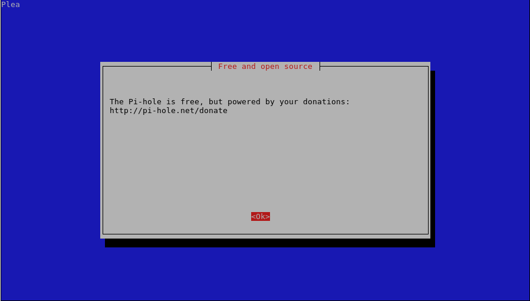

= Pi-hole: Blocking b(ad) stuff via DNS
Chuck Frain <chuck@chuckfrain.net>
:toc: left

== Introduction

This talk is gear to help you block unwanted sites from your network at the DNS level.

== What is DNS?

DNS stands for Domain Name System.
It translates the IP address of a computer to a hostname.

calug.org translates to 173.236.168.90
google.com translates to 172.217.7.238

== Ways to install Pi-hole

All of the major distros and their derivatives are supported with the install script.

. If you have a running Linux system:

* `curl -sSL https://install.pi-hole.net | bash`

. Download script and install

* `wget -O basic-install.sh https://install.pi-hole.net`
* `bash basic-install.sh`

. Docker Image

* `docker pull diginc/pi-hole`

== Initial Configuration

Performed at the command line.
We will be using the following command:

`curl -sSL https://install.pi-hole.net | bash`

The basic steps after running the command are:

. sudo to the root user to install packages
. Step through the configuration screens with the following being the notable ones
. Select DNS server(s)
.. If using a local DNS server other than pi-hole, point to that one using the custom option
. Select static IP address
. Do you want to use the web admin interface? Defaults to yes
.. Not https by default
. Enable logging of queries? Defaults to yes

== Web Configuration

== Local Network Considerations

== Updating and Adding Lists

== Appendix

=== Initial Configuration Notes

After running the 'curl' command

. sudo to the root user

[source,bash]
pi@raspberrypi:~ $ curl -sSL https://install.pi-hole.net | bash
:::
::: Script called with non-root privileges. The Pi-hole installs server packages and configures
::: system networking, it requires elevated rights. Please check the contents of the script for
::: any concerns with this requirement. Please be sure to download this script from a trusted source.
:::
::: Detecting the presence of the sudo utility for continuation of this install...
::: Utility sudo located.
:::
::: You are root.

. Begin walking through the configuration options

